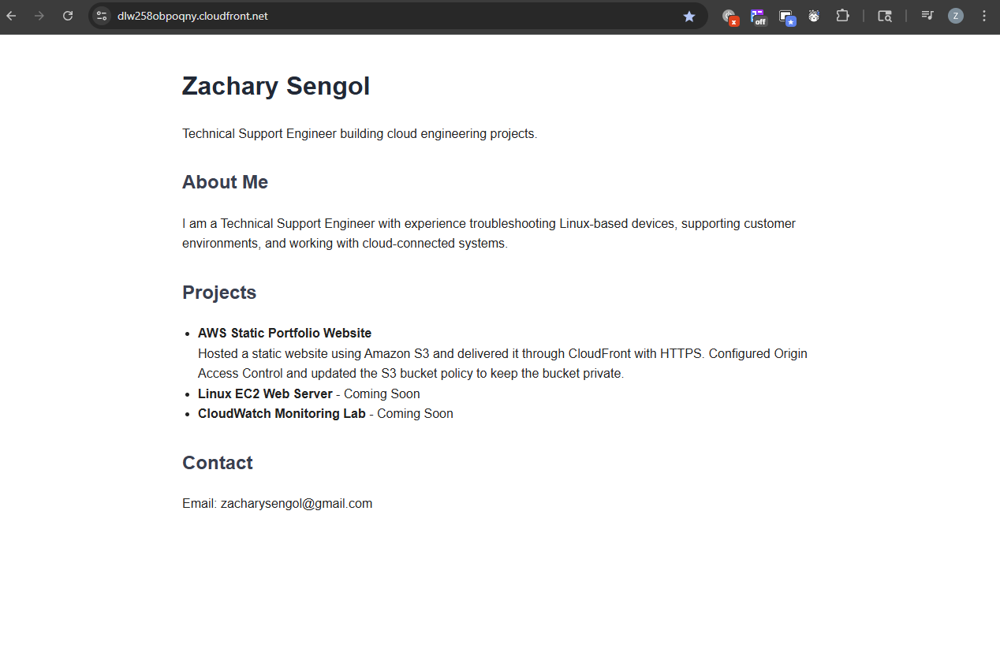
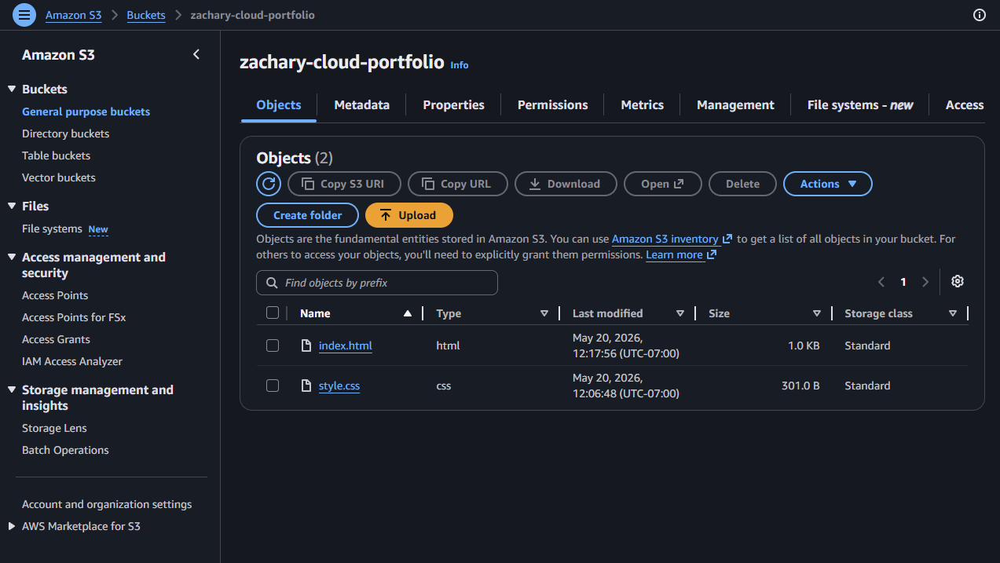
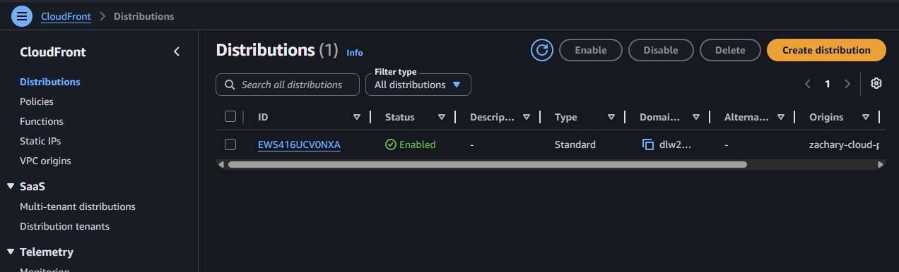
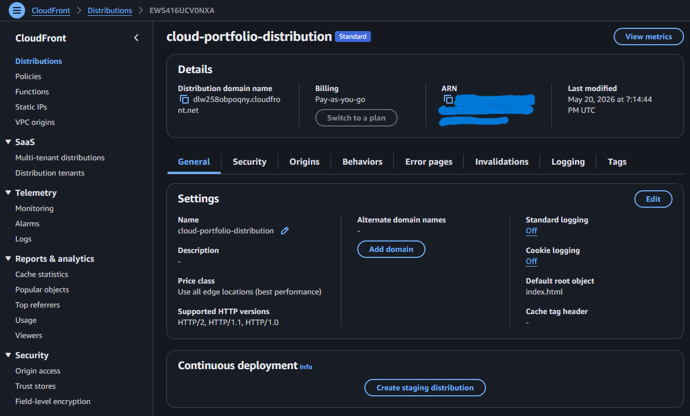
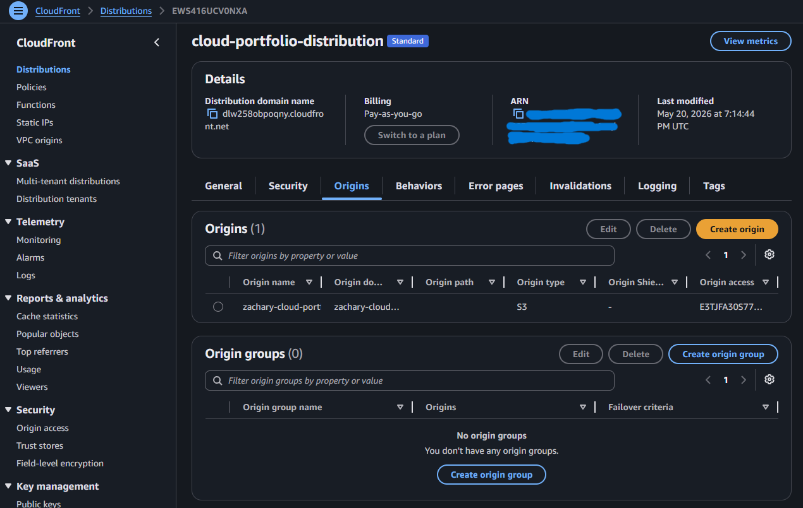

# AWS Static Website with S3 and CloudFront

## Overview
This project is a static portfolio website hosted on Amazon S3 and delivered through Amazon CloudFront.

## Services Used
- Amazon S3
- Amazon CloudFront
- AWS IAM

## What I Built
- Created an S3 bucket to store static website files
- Uploaded an HTML website to the bucket
- Created a CloudFront distribution to serve the website globally
- Tested the live CloudFront URL
- Documented the deployment process with screenshots

## Architecture
User → CloudFront → S3 Bucket → Static Website Files

## What I Learned
- How static websites can be hosted using S3
- How CloudFront distributes content through edge locations
- How permissions affect access to S3-hosted content
- How to troubleshoot deployment and access issues

## Challenges
I ran into permission-related confusion while setting up the S3 bucket and CloudFront distribution. I worked through the issue by reviewing access settings and testing the CloudFront URL until the website loaded correctly.

## Screenshots

### Live Website

### S3 Bucket Objects

### CloudFront Distribution

### CloudFront Details

### CloudFront Origin

